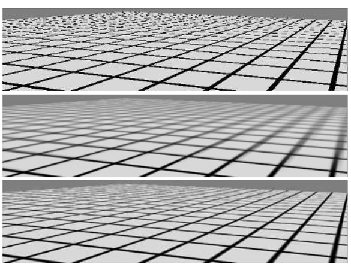
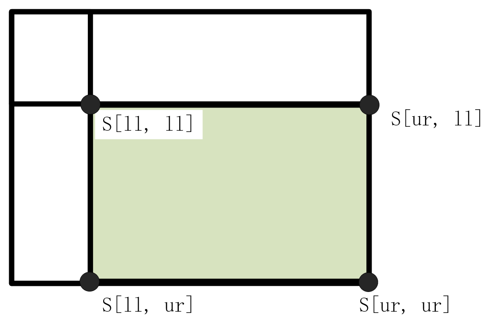

# Chapter.6 纹理

## 纹理管线

纹理化（texturing）是⼀种⽤于描述表⾯材质以及对表⾯进⾏修饰加⼯的有效技术，⼀种理解纹理的⽅法是，思考单个着⾊像素会如何发⽣变化。
粗糙度纹理改变了表面的粗糙度值，凹凸纹理改变了表面着色法线的方向，每个纹理都会影响最终着色方程。


纹理化始于texture mapping，这一过程通过对模型用projector function处理以获得纹理坐标(texture coordinate)。
在通过纹理坐标访问纹理之前，还需要通过一个或多个转换函数，将纹理坐标转换到纹理空间中。

具体来说，object space loaction代表了空间中模型表面的某个点，这个空间往往是该物体的局部坐标系，因为纹理总是跟着其着色的面乃至所在的物体模型移动。这个点毋庸置疑是一个三维坐标(x, y z)，**投影函数**因而根据三维坐标转换为一个纹理坐标texture coordinate space(u, v)。
纹理坐标(u, v)坐标系均在0-1范围内，但是纹理图像（纹理空间）是一段图片形式存在的离散数据，二维的形式一般是几百乘以几百的大小，所以uv坐标还需要转为一个最近邻坐标，通过corresponder function获取像素坐标texture location。
但这还没有到最后一步，最后往往需要一个value Transform function进行转换，在这个阶段会基于一些表面特性或着色法线进行转换。

管线只是起到了指导作用，并不代表需要严格遵守的工作流程。

### 投影函数 projector function

这一部分对应纹理处理的第一步是获取表面的位置，并将其投影到纹理坐标。
投影函数的最终⽬标是⽣成纹理坐标，将其作为⼀个与位置有关的函数来进⾏推导，只是其中的⼀种⽅法。

总的来说，一般分为球面投影、柱面投影和平面投影。
效果在同一个不规则物体上呈现出来差异较大。

实时渲染中通常会选择最合适的投影方式，并且计算出来相应的结果数据(uv)存储在顶点相关的数据文件上，有时候也会选择在v/f shader中实时计算，为了提高精度。投影的目标是金陵啊保证每个多边形（面）在投影的过程中尽量占据更加公平的份额，以免不同的近似跨度导致色彩畸变。

纹理坐标也不一定就是（u,v）有时候可能是(u, v, w)，甚至于（s, t, r, q），q代表了齐次坐标中的第四个分量，例如适用于装饰性聚光灯效果(gobo)

一维的纹理保证有效的同时加强了优化的效果，例如远处的山地随海拔发生的渐变，雨点的渐变。
从始至终需要明白的是，渲染的本质是服务相机的工作流，因此纹理空间的每个点需要考虑输入方向。最简单的一种情况，曲面空间上每一个点的输入方向是其法线方向。

### 转换函数 corresponder function

转换函数的应用面非常广。

转换函数将uv转换为纹理空间中的具体位置，通过在图形API中选择现有纹理的一部分，并且后续操作中只会用到这一部分数据。另一个例子是在shader中对纹理进行平移缩放和剪切等操作。
最后是一个广为认知的应用形式，即定义wrapping mode，例如clamp（边缘拉伸），mirror（重复并翻转），wrap（重复）和border（超出范围纯色）

无论是翻转还是重复，都不能简单应用于大面积的纹理铺设，例如地面，因为很容易被察觉且单调。有很多现存的方式进行处理，例如多个纹理的复合随机堆叠，将一张纹理瓦片化，选取不同的瓦片块随机组合。

最后，将uv统一化之后，对于不同的纹理图像可以进行统一的像素值索引，而不需要修改预设的纹理坐标。

### 纹理值

纹理坐标uv被输入转换函数后，转换为对应的纹理值，纹理值的形式并不固定，可以使RGB或是RGBA，然而这只是最简单的一类之一（albedo），表面粗糙度，金属度等也因此而产生。

## 图像纹理

fragment shader通过texture2D将纹理坐标转化并访问纹理，纹理坐标实际是经由GPU被转换为纹素坐标，纹理坐标的格式在不同的图形API中规范也不一样。

像素在微观的建模下是单元格，而像素本质上是单元格中心点的颜色值。为了更好的质量，像素会且应当受到其相关单元格之外的采样影响。DX9中定义每个纹素在单元格的（0, 0）处，但是在10和11中改为了每个单元格的（0.5, 0.5），和OpenGL一样。

有时候我们经常需要两个纹素坐标之间的位置，并且基于位置进行插值，有两种处理方式：截断（truncate）和摄入（round），对于截断而言，当一个像素位于（5，9）时，指的是u轴上5.0-6.0的范围，v轴上9.0-10.0的范围。

### 依赖纹理读取

依赖纹理读取（dependent texture read）包含对于移动端设备和早期的桌面GPU两个方面的定义。

对于移动端设备而言，在fs内手动计算纹理坐标并通过texture2D或类似的方式访问纹理时，而不是通过vs传入颜色坐标时，就会发生依赖纹理读取，任何对于输入纹理坐标的手动修改都会发生以来纹理读取。
对于早期的GPU而言，当一个纹理坐标依赖于之前的纹理值结果时就会发生依赖纹理读取。
例如：⼀个纹理可能会改变表⾯的着⾊法线，这反过来⼜会改变⽤于访问⽴⽅体贴图（cube map）的坐标。这种功能在早期的GPU上是受限的，甚⾄是不存在的。

现代GPU可以处理非2次幂（NPOT）的纹理，但是比较老的GPU不支持POT格式外的mipmap，不同的图形API对于纹理尺寸有着不同的上限，例如DX12允许最多$16384^2$个纹素。

### 纹理放大

对于纹理的放大采样也就是一些比较常见的方法，比如邻近过滤，双线性过滤，三次滤波。

**邻近过滤**就是在放大采样时不计算新的像素值，而是选取纹素中心最近的点。这种方法只需要为每个像素获取一个纹素即可。但是图像会非常像素化。

**双线性插值**就是非常平滑的线性插值，效果和低通滤波器很类似。


无论如何，对于纹理进行放大采样总是会造成视觉效果的损失，一种用于解决放大模糊的常见方法是使用细节贴图，这有点类似于之前说过的瓦片贴图的堆叠。使用另外的细节贴图覆盖在被放大的纹理上，通过将高频的重复细节和低频的模糊底色相结合，类似于使用单张高分辨率的纹理图案。

**双三次插值**（bicubic filter）的计算成本更高，但是可以在视觉上略微改善剩余的像素感。

平滑曲线被提出在一组2*2纹素之间用于放大采样，最常⽤的两个平滑曲线分别是smoothstep曲线和quintic（五次）曲线。

$$
smoothstep: \space s(x) = x^2(3-2x)
$$

$$
quintic: \space q(x) = x^3(6x^2 - 15x + 10)
$$

smoothstep曲线具有$s'(0) = 0$并且$s'(1) = 0$的性质，而且具备最基本的特性，即平滑。
quintic则更进一步，$q''(0) = 0$并且$q''(1) = 0$.

### 纹理缩小

也许第一次想象如何设计的时候，你会认为缩小采样仅仅通过卷积或者邻近插值采样就能够很好实现，但是这种方法可能会造成严重的时域锯齿（temporal aliasing），原因在于这会导致较大的像素色彩跳跃。

这种情况往往发生于较高的LOD等级下，远处的物体可能只需要几个像素点，mipmap就是为了解决这一问题而使用的技术。⽽当⼀个像素受到超过四个纹素的影响时，双线性插值就会很快失效并产⽣锯⻮。

缓解反采样问题有很多方法，除了邻近采样，下面简单介绍mipmap和SAT表三种方式。纹理的信号频率取决于所使用的纹素在渲染空间上的间隔距离，根据奈奎斯特极限，所使用的纹理信号频率不大于采样频率的一般即可，这意味着，考虑提高采样频率或者降低纹理频率是有效手段。
实际上，mipmap就是一种降低纹理信号频率的方式。

所有纹理抗锯⻮算法背后的基本思想都是相同的：对纹理进⾏预处理，创建某种数据结构，从⽽快速近似计算⼀组纹素对像素的影响。对于实时渲染⽽⾔，这些算法在执⾏过程中具有使⽤固定时间开销和资源开销的特点。

#### mipmap

**生成mipmap纹理**
mipmap实际已经广泛应用于图形软件，生成高质量mipmap亦有诀窍，常用方法是将对于2*2纹素进行平均，涉及平均计算自然就是盒滤波器。盒滤波器不仅会模糊低频信息，还会保留一些产生锯齿的高频信息，高斯、Lanczos、Kaiser或者类似的滤波器会有更好的效果。

需要注意的是，对于非线性空间中进行编码的彩色纹理，在过滤时忽略伽马校正会修改生成的mipmap贴图的感知亮度，在这种情况中，相机离物体越远就会导致物体的视觉效果越暗。所以解决方法是保证mipmap的生成要在线性空间中生成，放大和缩小的采样操作同样如此。

不仅是这个原因，一些纹理参数与最终的着色颜色之间具有非线性关系，会在第九章详细介绍。

**使用mipmap纹理**
生成mipmap后，另一个问题是实时渲染过程汇总如何访问mipmap集合，该选什么等级的mipmap纹理，因为视角问题，往往一个像素在投影过程中会包含多个纹素，覆盖的范围极有可能是不规则的，位于范围外的纹素也会对该像素最合理的颜色产生影响。我们可以这样假设，一个像素在纹理空间上的投影是一个大小、位置和方向可能任意的矩形区域。


一般来说，需要是首先确定纹理细节等级，也就是常说的LOD等级，LOD等级有两种常用计算方法：
一种是取该矩形区域，较长的边对于像素的范围进行近似。参考"Pyramidal parametrics"这篇论文

另一种则更为复杂，但主流，即通过梯度值判定，四个梯度值分别是渲染空间中的xy轴沿着纹理空间的uv两个轴上的梯度值。

$$
\frac{\partial u}{\partial x}, \frac{\partial v}{\partial x} \\
$$

$$
\frac{\partial u}{\partial y}, \frac{\partial v}{\partial y}
$$

参考"Fast Filter Width Estimates with Texture Maps"。这四个分量简而言之代表了纹理坐标相对于屏幕轴向的变化量。
举个例子，$\frac{\partial u}{\partial x}$代表一个像素所对应的纹理坐标u，沿着屏幕x轴的变化量。
"MIP-Map Level Selection for Texture Mapping"考量几种不同的选择方式之间的优劣。

在shader model3.0之后，梯度值可以在fs中被直接使用。但是如果不支持的话，需要提前另外计算梯度值，只有在顶点纹理化阶段提供细节级别的信息。

根据之前所要求的，被采样的纹理空间要符合奈奎斯特极限，当一个像素包含多个纹素时，就应该提高LOD等级以便于访问尺寸更小更加模糊的mipmap层级。尽管如此，LOD并不是一个整数以指向某张固定的mipmap纹理空间，其被计算出来用来表示两个级别之间的距离分数，具体为输入三元组(u,v,d)，通过uv索引两个级别的纹理空间之间的两组被双线性插值后得到的像素值，并基于该权重d进行最后的第三次插值。

mipmap标准计算流程的成本开销是基本固定的，虽然成熟但其也有很多缺陷，比如会造成过度模糊(overblurring)，假想该矩形区域两条轴长度差异较大，即在一个方向上覆盖过大的纹素而另一个方向上只有非常少量的纹素，这相当于渲染空间中一个面相较于摄像机光线成掠射角度。但是LOD等级基于最大的梯度值，这个梯度值作为LOD等级在mipmap纹理空间上采样时，包含的是一个正方形区域内的像素信息，包含过多不合适的像素信息时就会造成模糊，这在经典的对比图像中非常显著。



#### SAT表

SAT表（Summed-area Table）其实很简单, 表中任意点f(x, y)的值为该点在纹理上的像素值与f(x-1, y-1)之和，而最左上角的点为对应的像素值。

基于其计算简单的特性，只需要些许的额外计算成本和内存开销，被广泛应用于现代图形应用中，例如各向异性过滤(anisotropic filtering)。这类算法⽤于检索⾮正⽅形投影区域的纹理值，SAT对于接近⽔平⽅向或者竖直⽅向的投影区域最为有效。

在纹理化的阶段，像素的颜色通过查找SAT表和如下公式进行计算：

$$
c = \frac{s[x_{ur}, y_{ur}] - s[x_{ur}, y_{ll}] - s[x_{ll}, y_{ur}] + s[x_{ll}, y_{ll}]}{(x_{ur} - x_{ll})(y_{ur} - y_{ll})}
$$

s[x, y]代表了位于SAT查找表的具体值，而该式中分子的含义为SAT表中一片矩形区域的值，



其他使⽤区域采样的算法也可以通过SAT⽅法进⾏改进。

#### 无约束的各向异性过滤

如果想要进一步改进纹理过滤的质量，最常见的方式是重用当今的mipmap硬件。基本思想是将像素单元格反向投影到纹理上，然后对于纹理上的四边形区域进行多次采样。

由上面对于mipmap的解析，纹理化过程中会在正方形区域内进行采样。这也会导致正方形区域包含了较多的无关纹素。
各向异性过滤会使用多个正方形区域进行近似，首先对于LOD的判定是四边形中较短的那个边确定，这样确保了每个mipmap的样本的平均面积更小，接着较长边用于创造一条与其平行且经过四边形中心点的各向异性线。
沿着各向异性线取两个样本，如果比例大于2：1，就取样更多。

简单介绍，这一部分也不是很懂，有空详细了解。

### 体积纹理

体积纹理就是基于三维坐标系访问的三维纹理，如今大部分GPU都支持体积纹理的mipmap，整体流程上差异不大，但是对于二维mipmap需要进行三线性插值，自然这里就需要通过四线性插值进行过滤。但是参与平均的纹素高达16个数据，精度损失的问题会更严重一些，如果就此考虑提高纹素的精度可能是权宜之计，但并非根本性的优化，甚至算不上是优化。

体积纹理需要更大的存储空间及带宽，也需要更高的计算成本，然而使用纹理坐标直接表达三维的空间位置，某种意义上跳过了纹理化管线的前几步，甚至顾及到了纹理拼接导致的扭曲接缝问题。
尽管如此，必须要意识到体积纹理的数据利用率其实极低。
对此针对性的改进，主要是数据格式上的，例如通过稀疏八叉树存储等。

### 立方体贴图 cube map

主要是用于环境映射中，第十章会详细介绍，这应该不陌生。
立方体包含六个面，访问立方体贴图需要提供一个三维向量。向量代表了从立方体中心向外发射的射线方向，向量中绝对值最大的那个分量会决定射线射向哪个面，接着另外两个分量会基于最大分量clamp至1进行相应的缩放，得出对应的立方体面上的纹理坐标。

### 纹理表示

texture atlas纹理图集，texture array纹理数组和bindless textures无绑定纹理已被广泛使用，目的是为了在实际渲染中避免无意义的纹理切换工作所带来的性能开销(以及开发成本)。
在第十九章还包含了texture streaming和texture transcoding的介绍。

为了使GPU更高效地在渲染过程中完成批处理，最好尽可能避免更改其状态，一种解决方式是将多个图像放入一个尺寸更大的纹理中，这个纹理被叫作纹理图集。一种更现代的方式就是用纹理数组，并非拼接而是批量设置为数组。

### 纹理压缩

这一部分可以参考另外的文档，写的很详细（然而离职了以后被滞留在公司了），以后有空重新扒回来。

需要注意的是一些显著性和颜色无关的纹理数据类型并不适合压缩，例如法线贴图和LUT查找表，这不难理解，法线和查找表本质只是以纹理为载体的数学数据，是包含了连续特征的离散几何信息和色彩映射关系集合的数据结构，而并非直接应用于视觉效果建设的自然（绘制）图像。粗暴的使用块压缩算法会严重破坏数据的适用性。

一种对于法线贴图压缩的方式是可以值保留x和y的分量，并在实时渲染的时候计算第三个分量，这是非常粗暴的时间换空间的方式，然而却出奇有效：一个分量一般为8bit，三个便需要24bit，大部分GPU并不支持三分量的纹理，因此三分量在传输时会被拓宽为4分量，也就是32bit，当两分量进行传输时，另外两个分量就可以存储其他的信息了。

通过BC5之类的相对低损方式进行压缩，也许能缓解，但是无法根除对视觉效果的显著影响。
参考"CryENGINE 3: Reaching the Speed of Light"，提供了一些优化方案。

"Objective Image Quality Assessment of Texture Compression"中也有一些关于压缩和视觉效果的探讨。

## 程序化纹理

我们都知道纹理是建设渲染颜色的数据载体，实际渲染依此为来源进行着色。
另一种方式就是提供数据的计算方式，例如一组或更多的函数，在着色时实时计算。这就是程序化纹理。
程序化纹理起先广泛应用于离线渲染，因为这能够减少开发和美术的负担。但是体积纹理的高昂存储成本可以通过程序化生成的方式显著优化。

湍流函数应愿而生，其主要是通过连续的2次幂频率对于数个噪声函数进行采样，并且基于不同的权重进行叠加。
然而随机噪声并非轻易生成，特别是对于高帧率的实时渲染场景。上传随机噪声纹理贴图是一种泛用的解决方法，这也是一个广泛讨论的研究领域。
"State of the Art in Procedural Noise Functions"讨论了一些研究现状。

程序化纹理是一条颠覆性的道路，因而需要考虑到方方面面，比如抗锯齿处理，mipmap这样的预计算方法肯定行不通；但是可以通过降低锯齿验证的噪声函数叠加权重来优化。

"Towards Automatic Band-Limited Procedural Shaders"回顾了一些程序化纹理的抗锯齿方案。

## 纹理动画

通过修改纹理坐标，可以动态展现纹理动画，这样的变换包含了平移，缩放，旋转和剪切等。

"Advanced Texturing Using Texture Coordinate Generation"进行了一些相关的介绍。

## 材质映射

纹理的主要用途就是用于修改材质属性，将物体渲染为现实风格或其他艺术风格。
最主要的是表面颜色，也就是反照率albedo，接着是粗糙度roughness和金属度metalness。
通过使用滤波技术，减少非线性着色输入数据造成的锯齿和走样现象，这部分在第九章中有所呈现。

## Alpha映射

Alpha通道可以用于Alpha混合或测试。
对于一些只存在1bit内容的贴图，比如树叶，周边为完全透明，内容物完全填色，通过将树或者灌木的贴图围绕中轴旋转创造廉价的3D效果。这种方式叫做镂空（cutout），通过切片，分层等方式处理1bit贴图创造3d视觉效果，且成本极低。

alpha混合（blending）用于更高精度的aloha通道场景，能够实现物体边缘的抗锯齿及透明视觉效果。但是从需求上，需要严格遵守从后向前的顺序进行渲染，且不透明面片必须优先渲染，当两个面片交叉相交时，这种处理办法就不再有效，因为每个面片都有一部分在另一者前面。
也许可以手动排序解决，但存在成千上万个镂空面片时性能成本将无法接受。

**双pass处理**需要额外的计算负担，第⼀个pass⽤于渲染实体（不透明）的镂空样本，同时写⼊z-buffer；另⼀个pass则⽤于渲染半透明的样本，此时并不会写⼊z-buffer。

**alpha测试**是其中一种解决方式，在fs阶段主动丢弃alpha低于阈值的片元以避免z-buffer种错误标记了可见的像素。
然而这会带来新的问题，根据mipmap我们知道，生成会对2*2区域内每个通道进行卷积，然而这会导致边界区域的alpha值被完全透明区域逐步"侵蚀"，如果不进行特殊处理，在LOD级别更高的渲染场景中，镂空贴图的视觉效果会因为alpha test被丢弃大量像素而严重弱化。
[witness](http://the-witness.net/news/2010/09/computing-alpha-mipmaps/)（也是我很喜欢的独立游戏）提供了一种解决方案，包含了在nvtt中更加成熟的实现。

具体而言，为每个mipmap等级考虑一个覆盖范围$c_k$：

$$
c_k = \frac{1}{n_k} \sum_i(\alpha(k, i) > \alpha_t)
$$

$n_k$表示为该等级下mipmap中的纹素个数，i代表贴图下的位置，因此覆盖率其实就是等级k下alpha值高于阈值的像素数量。明确了这一点之后，目标就变为了尽量保证每个等级的覆盖率$c_k$尽可能靠近原始图像$c_0$，而能够影响这一过程自然就是需要开发者控制的参数阈值$\alpha_t$，这一部分可以通过二分查找快速定位。

[另一种方法](https://casual-effects.com/research/Wyman2017Hashed/index.html)在此基础上进一步改善了视觉效果，在所提出的方法中，将固定的阈值替换为了通道值域内的随机函数random()
这意味着当该片元上的aplha值为0.3时，会有30%被丢弃，random函数被进一步优化，以避免高频噪声：

```cpp
float hash 2D(x, y) {
    return fract(1.0e4 * sin (17.0 * x + 0.1 * y) * (0.1 + abs(sin(13.0 * y + x))));
}
```

fract()函数用于将结果以周期函数形式加减至$[0,1)$内，该函数的输入坐标为，物体局部空间坐标除以该坐标相对于屏幕空间（x⽅向和y⽅向）的最⼤导数，然后再对其进⾏clamp操作。
这样设计的目的是希望随机性随着视距增加而渐隐，在很近的距离上随机效果最低，以保证不会丢弃太多关键像素，这平衡了平均视觉效果并降低了随机计算的性能负担。

另外一个问题是alpha test会在放大的情况下出现波纹瑕疵(ripple artifact),valve提出了一种基于[距离场的方法](https://steamcdn-a.akamaihd.net/apps/valve/2007/SIGGRAPH2007_AlphaTestedMagnification.pdf)

此外，因为存在对于较低alpha值剔除的机制，可能会导致树叶在近距离下存在黑边的问题，连续下降的alpha值被一刀切，使得边界有大量黑色像素。

Alpha To Coverage是一种自适应透明度抗锯齿算法，需要基于MSAA。
一个像素的色彩值来源于四个（或者多个）采样点，考虑片元的透明度分为以0.25为跨度的多个等级，并用四位的二进制掩码表示。每个采样点sample下的片元根据alpha值削减为相应的像素色值，最后计算时再将

## 凹凸映射

凹凸映射通过逐像素修改着色例程，提供比纹理映射更加立体的视觉效果。
细节可以分为三个尺度，从覆盖大量像素的宏观特征，覆盖少数像素的细节特征，到影响一个像素的微观特征。

宏观特征例如皮肤，布料的整体特征，细节特征用于描述例如这周，皱纹，肌肉细节。最早的Blinn模型就提出了通过修改法线实现不同的视觉细节效果。

最关键的是，并非修改着色或光照方程，而是应该使用纹理贴图修改法线参数。对于凹凸映射而言，表面法线必须相对于某个参照系改变自身的方向，因而引入了切线坐标系TBN。
t：切线向量tangent vector  b：副切线向量bitangent vector n：法线向量normal vector

### Blinn方法

Blinn原始的凹凸映射方法是在每个纹素上存储两个带符号的值，分别定义为$b_u$和$b_v$，这个两个向量被定义存在于该纹理的切平面上，也就是它们均垂直于法线向量。
在实时渲染中，通过将这两个向量叠加，形成一个同样垂直于法线的向量，然后与法线相叠加，完成方向的改变。
这样的信息贴图被称为偏移矢量凹凸贴图（offset map）

另一种方法相对更为人知，即通过高度场进行修改。高度场纹理通过单通道纹理完成，黑色代表更低的区域，反之亦然。
通过单个通道的值推导出上述方法中的u和v，具体来说，u就是相邻列差值的斜率，v就是相邻行差值的斜率。

### 法线映射

更广泛的方式是直接存储法线贴图(normal map).
图像的每个颜⾊通道，实际上都是表⾯法线坐标的⼀个分量。红⾊通道代表了法线在x⽅向上的偏移；法线贴图，视觉效果上颜⾊越红，代表了修正后的法线越指向右。
绿⾊通道是y⽅向上的偏移，而蓝⾊通道是z⽅向上的偏移。具体来说，假设一个8bit的通道，0~127在计算时被缩放至-1~0，剩下的则为0~1。

这意味着法线贴图所谓承载法线信息的数据，已经牢牢和模型的几何性质相绑定，可复用性较低。

另一问题是对于法线贴图的过滤较为困难。
⼀般来说，法线与着⾊结果之间的关系并不是线性的，因此标准的滤波⽅法可能会产⽣令⼈讨厌的瑕疵。

lambertian材质表面就是将发现和摄像射线进行点乘，基于这样的线性运算，在盒滤波器场景下大量像素的着色计算几乎不会造成显著误差。尽管如此，参与点乘的平均法线向量不一定进行归一化处理，因为朗伯模型下点乘是经由clamp过的结果，结果被限制在0以上，因此掠射场景下会产生大量黑色像素：

$$
max(\bold{l} \cdot \bold{n}, 0)
$$

也可以从高度贴图中推导出法线贴图，通过中心差分分别计算在贴图h上x和y方向的梯度近似值：

$$
h_x(x,y) = \frac{h(x+1, y) - h(x-1, y)}{2}
$$

$$
h_y(x,y) = \frac{h(x, y+1) - h(x, y-1)}{2}
$$

则(x, y)处的非归一化法线为：

$$
\bold{n}(x,y) = (-h_x(x, y), -h_y(x, y), 1)
$$

[smooth mapping](http://gameenginegems.com/geg3.php)用来增强法线贴图，以提供在表面上透射阴影的效果。

## 视差映射

凹凸映射和法线映射实际上只是在一些简单的表面上模拟复杂的视觉效果，而并非从顶点层面创造凹凸关系，这带来一定的问题，当表面过于的崎岖不平时，理应发生一些遮挡关系效果。这是凹凸贴图无法带来的效果。

[视差映射](https://icat.vrsj.org/papers/01205.pdf)于2001年被提出，并被[改进](https://www8.cs.umu.se/kurser/5DV051/HT11/lab/parallax_mapping.pdf)

我们假设一块表面，表面的凸起被存储于一个高度场纹理中（单通道）。实际渲染中，观察至某个像素上时僵毁检索对应的高度场值，并基于一个偏移检索不同位置上的高度场值，这很好理解，一个像素是否会被观察到，要检索其他位置的高度以确定，具体如图所示：


具体来说，会根据观察射线在该纹理空间平面上的投影，向其反方向检索目的点高度值和观察向量相结合的距离以检测是否被遮挡。

和许多纹理一样，高度场纹理会在必要的时候被缩放和偏移，缩放取决于高度场在地表上延伸的高度，而偏移取决于不发生变化的那一个标准高度。
如果凹凸的变化幅度相对比较慢，这会有很好的效果，因为相邻像素内的高度的遮挡关系会被近似地相当准确。当掠射角度下观察下，极小的高度变化也会导致很大的纹理偏移。无论是检索的计算成本还是高度相关性近似都会变得不适用。

改进方法中，引入了偏移限制的概念，以限制偏移量的最大值，这个值就是检索到的⾼度值，如图所示：


[另一种方法](https://developer.nvidia.com/gpugems/gpugems2/part-ii-shading-lighting-and-shadows/chapter-9-deferred-shading-stalker)通过在凹凸贴图的法线防线，对于估计位置进行偏移，实现改善遮挡效果的目的。

### 视差遮挡映射


通过在fs中沿着观察向量进⾏光线步进，找到与表面高度场第一个近似交点，完成视差映射的一个最简单的实现。相关或者改进的算法称为视差遮挡映射POM(parallax occlusion mapping)或浮雕映射。
关键思想是：⾸先沿着观察⽅向的投影向量，对固定数量的⾼度场纹理样本进⾏测试。在掠射观察⻆度下，通常会⽣成数量更多的样本，以便不会遗漏这个最近交点。

图中可以看的很清晰，从视角到达的像素开始沿轴的反方向以固定步幅进行步进，然后在间隔的采样点所对应的折线上，和观察向量相交的那个点，找到那个点所在的位置，所对应的法线贴图，颜色贴图或者其他纹理进行额外着色。
多层高度场可以用来生产悬垂结构和复杂双面浮雕，第13章有相关说明。

相关的成果有很多，简单罗列一些：

一次迭代割线法[1](https://dl.acm.org/doi/10.1145/1111411.1111423)和[2](https://dl.acm.org/doi/10.1145/1185657.1185830)

[基于二分查找寻找最近点](https://shintaroiguchidotcom.wordpress.com/wp-content/uploads/2016/01/relief-mapping-in-a-pixel-shader-using-binary-search.pdf)

[并行间隔采样并迭代割线](https://www.tandfonline.com/doi/abs/10.1080/2151237X.2007.10129244)

[刺客信条黑旗中也提到了暴力求解法](https://bartwronski.com/wp-content/uploads/2014/03/ac4_gdc_notes.pdf)

采样频率或者说间隔会显著影响到结果的正确性，通过使用各向异性的mipmap确保对于高频高度场采样被[提出](https://casual-effects.com/research/McGuire2005Parallax/index.html)

还有⼀种提⾼性能和采样精度的⽅法，即不以固定的间隔来对⾼度场进⾏初始采样，这里也罗列一些：

[将⾼度场预处理成⼀组体素](https://developer.nvidia.com/gpugems/gpugems2/part-i-geometric-complexity/chapter-8-pixel-displacement-mapping-distance-functions)以尝试跳过空白区域。

[五维位移映射](https://www.microsoft.com/en-us/research/wp-content/uploads/2016/12/Generalized_Displacement_Maps.pdf)以空间换时间，记录了更复杂的方向和位置信息。

[定向距离图](https://dl.acm.org/doi/abs/10.1145/2425333.2425367)希望能够达成类似的效果。

[锥形步进映射](https://diglib.eg.org/server/api/core/bitstreams/c6853f7d-4962-412f-927e-462fe29031d1/content)以及其后续[改进](https://developer.nvidia.com/gpugems/gpugems3/part-iii-rendering/chapter-18-relaxed-cone-stepping-relief-mapping)

[四叉树浮雕映射和最大化mipmap](https://developer.nvidia.com/gpugems/gpugems3/part-iii-rendering/chapter-18-relaxed-cone-stepping-relief-mapping)

[存储在mipmap中的类四叉树](https://www.taylorfrancis.com/chapters/edit/10.1201/9781351261524-1/quadtree-displacement-mapping-height-blending-micha%C5%82-drobot)结构用于在遍历进⾏加速。

上述所有⽅法都存在⼀个问题，即这种视差错觉会在物体的轮廓边缘处消失，转⽽会显示出原始表⾯的平滑轮廓，被渲染的三⻆形仅仅定义了哪些像素应当由像素着⾊器进⾏计算，⽽不是表⾯上的实际位置，因此位于表平面之外的像素都不会受到视差映射的影响。

⼆次轮廓近似相关的文献[1](https://www.inf.ufrgs.br/~oliveira/RTM.html)和[2](https://smile.amazon.com/Advanced-Development-Programmable-Graphics-Hardware/dp/156881240X)

有两篇泛用性更强且更加鲁棒的方法[1](https://www.cg.tuwien.ac.at/research/publications/2007/JESCHKE-2007-ISC/)和[2](https://inria.hal.science/inria-00606806/PDF/Dachsbacher-Tatarchuk-Prism_Parallax_Occlusion_Mapping_with_Accurate_Silhouette_Generation_SI3D07_.pdf)

[另一种方法](https://www.researchgate.net/publication/2919917_Hardware_Accelerated_Per-Pixel_Displacement_Mapping)将⽹格中的每个三⻆形向外挤压形成棱柱（prism）的想法，然后渲染这个棱柱，计算所有可能会出现⾼度场中的像素。

